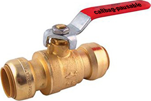

# ⏯️ callbag-pausable

[](https://www.npmjs.com/package/callbag-pausable)
[](https://npm-stat.com/charts.html?package=callbag-pausable)
[](https://travis-ci.org/erikras/callbag-pausable)
[](https://codecov.io/gh/erikras/callbag-pausable)



[Callbag](https://github.com/callbag/callbag) operator that allows data and talkbacks to pass through it freely until it receives a data or talkback message of `PAUSE`, in which case it stops the downflow of data until it receives another data or talkback message of `RESUME`.

Think of it like a valve on a pipe.

## Usage

<!-- prettier-ignore -->
```js
import interval from 'callbag-interval'
import observe from 'callbag-observe'
import pipe from 'callbag-pipe'
import pausable, { PAUSE, RESUME } from 'callbag-pausable'

const source = pipe(interval(100), pausable)

setTimeout(() => {
  console.log('PAUSING')
  source(1, PAUSE)
}, 400)
setTimeout(() => {
  console.log('RESUMING')
  source(1, RESUME)
}, 1000)

observe(console.log)(source) // 0
                             // 1
                             // 2
                             // PAUSING
                             // RESUMING
                             // 9
                             // 10
                             // 11
                             // ...
```

<!-- prettier-ignore-end -->

Or, as a talkback to an existing callbag (assuming `callbag$` has `pausable` somewhere in its pipe):

<!-- prettier-ignore -->
```js
const sendTalkbackValue = (callbag$, value) => {
  callbag$(0, (type, talkback) => {
    if (type === 0) {
      talkback(1, value) // send value
      talkback(2)        // terminate
    }
  })
}
const pause = callbag$ => sendTalkbackValue(callbag$, PAUSE)
const resume = callbag$ => sendTalkbackValue(callbag$, RESUME)
```

<!-- prettier-ignore-end -->
